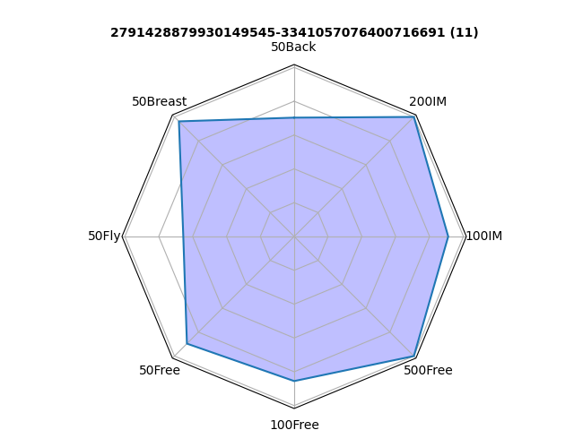
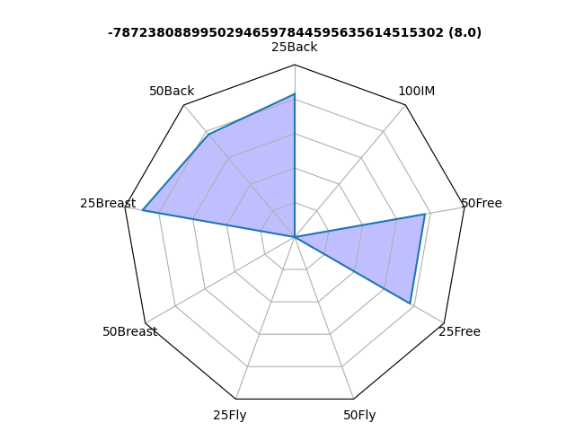

# Swim Data Tools

Tools for processing athlete report cards and generating performance visualizations.





## Quick Start

```python
import pandas as pd
import data_tools

# Load swimtopia report card CSV and convert to swim records
swims = data_tools.report_card_to_swims("reportcards/swimtopia_reportcard.csv")

# Get an athlete's scores across all events for a specific age
scores = data_tools.swim_score_from_swims(swims)
athlete_scores = scores[scores["FullName"] == "FULLNAME"]
athlete_age_14 = athlete_scores[athlete_scores["Age"] == 14]

# Get events available for age 14
events = data_tools.events_from_age(swims, age=14)

# Create radar chart (TeamAgeSwimScore = % of team best for that event/age)
fig, ax = data_tools.build_swim_score_chart(athlete_age_14, events, path="athlete_chart.png")
```


## Functions

### `report_card_to_swims(csv_path, obscure=0, age_limit=99)`
Converts a report card CSV into individual swim records.
- **obscure**: Hash names if 1 (for privacy)
- **age_limit**: Filter to swimmers ≤ age

### `swim_score_from_swims(swims)`
Calculates each athlete's score as **% of team best** for each event/age combo.
- Higher = closer to team best time
- Score = (Best Time / Athlete Time) × 100

### `events_from_age(swims, age)`
Returns all unique events for a given age group.

### `build_swim_score_chart(swimmer_scores, events, path=None)`
Generates a radar chart showing athlete's scores across events.
- **path**: Save to file; if None, displays interactively
- Returns: `(fig, ax)` for further customization

## Example: Loop All Ages & Save Charts

```python
import os
os.makedirs("charts", exist_ok=True)

for age in sorted(scores["Age"].unique()):
    age_scores = scores[scores["Age"] == age]
    events = data_tools.events_from_age(swims, age)
    
    for athlete in age_scores["FullName"].unique():
        athlete_scores = age_scores[age_scores["FullName"] == athlete]
        filename = f"charts/{athlete}_age{int(age)}_radar.png"
        data_tools.build_swim_score_chart(athlete_scores, events, path=filename)
```

## Data Structure

- **FullEvent**: Event code (e.g., "50Free", "200IM")
- **ResultSec**: Time in seconds
- **TeamAgeSwimScore**: Performance score (0-100)
  - 100 = tied for team best
  - <100 = slower than team best
  - 0 = no recorded time
